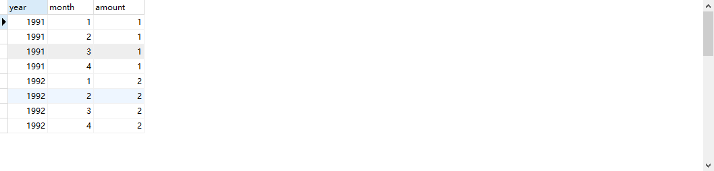
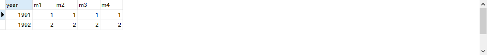
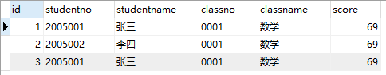
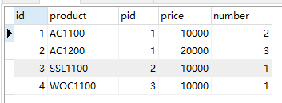
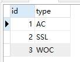
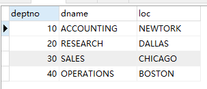
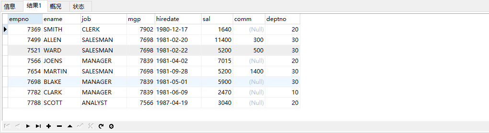

## 用一条SQL 语句 查询出每门课都大于80 分的学生姓名

建表语句：

```sql
create table tableA
(
    name varchar(10),
    kecheng varchar(10),
    fenshu int(11)
) DEFAULT CHARSET = 'utf8';
```

插入数据

```sql
insert into tableA values ('张三','语文',81);
insert into tableA values ('张三','数学',75);
insert into tableA values ('李四','语文',76);
insert into tableA values ('李四','数学',90);
insert into tableA values ('王五','语文',81);
insert into tableA values ('王五','数学',100);
insert into tableA values ('王五','英语',90);
```

答案有3种：

```sql
# 答案A：
select distinct name from tableA where name not in (select distinct name from tableA where fenshu<=80)
# 答案B：
select name from tableA group by name having min(fenshu)>80
# 答案C：
select name from tableA group by name having count(kecheng)>=3 and min(fenshu)>=80
```

## 一道SQL语句面试题，关于group by表内容：

一道SQL语句面试题，关于group by表内容：

```txt
2005-05-09 胜
2005-05-09 胜
2005-05-09 负
2005-05-09 负
2005-05-10 胜
2005-05-10 负
2005-05-10 负
```

如果要生成下列结果, 该如何写sql语句?


建表语句：

```sql
create table tableb (
    rq varchar(10),
    shengfu nchar(1)
)DEFAULT CHARSET = 'utf8';
```

插入数据：

```sql
insert into tableb values('2005-05-09','胜');
insert into tableb values('2005-05-09','胜');
insert into tableb values('2005-05-09','负');
insert into tableb values('2005-05-09','负');
insert into tableb values('2005-05-10','胜');
insert into tableb values('2005-05-10','负');
insert into tableb values('2005-05-10','负');
```

答案：

```sql
select rq, sum(case when shengfu='胜' then 1 else 0 end)'胜',sum(case whenshengfu='负' then 1 else 0 end)'负' from tableb group by rq
```

## 用一条sql 语句显示所有可能的比赛组合

一个叫 team 的表，里面只有一个字段name, 一共有4 条纪录，分别是a,b,c,d, 对应四个球对，现在四个球对进行比赛，用一条sql 语句显示所有可能的比赛组合

team表建表语句:

```sql
CREATE TABLE team (
	`name` varchar(20)
) DEFAULT CHARSET=utf8;
```

插入数据：

```sql
INSERT INTO team VALUES ('a');
INSERT INTO team VALUES ('b');
INSERT INTO team VALUES ('c');
INSERT INTO team VALUES ('d');
```

答案：

```sql
select a.name, b.name from team a, team b where a.name < b.name
```

结果如图所示：


## 统计年度中月度细则总和

怎么把这样一个表儿



查成这样一个结果



建表语句：

```sql
CREATE TABLE table1 (
`year` int (11),
`month` int (11),
`amount` DECIMAL
) DEFAULT CHARSET=utf8;
```

插入数据：

```sql
INSERT INTO table1 VALUES (1991,1,1.1);
INSERT INTO table1 VALUES (1991,2,1.2);
INSERT INTO table1 VALUES (1991,3,1.3);
INSERT INTO table1 VALUES (1991,4,1.4);
INSERT INTO table1 VALUES (1992,1,2.1);
INSERT INTO table1 VALUES (1992,2,2.2);
INSERT INTO table1 VALUES (1992,3,2.3);
INSERT INTO table1 VALUES (1992,4,2.4);
```

答案：

```sql
select year,
(select amount from aaa m where month=1 and m.year=aaa.year) as m1,
(select amount from aaa m where month=2 and m.year=aaa.year) as m2,
(select amount from aaa m where month=3 and m.year=aaa.year) as m3,
(select amount from aaa m where month=4 and m.year=aaa.year) as m4
from aaa group by year
```

## 删除除了自动编号不同, 其他都相同的学生冗余信息

学生表建表语句：

```sql
create table tablestudent
(
    id int(11),
    studentno varchar(10),
    studentname varchar(10),
    classno varchar(10),
    classname varchar (11),
    score int (11)
)DEFAULT CHARSET = 'utf8';
```

插入数据:

```sql
insert into tablestudent values (1,'2005001','张三','0001','数学',69);
insert into tablestudent values (2,'2005002','李四','0001','数学',69);
insert into tablestudent values (3,'2005001','张三','0001','数学',69);
```

如图所示：



答案：

在mysql中，不能通过嵌套子查询来直接删除或者修改记录，需要通过别名来指定嵌套子查询作为一个临时表。

给嵌套子查询的结果取一个别名，然后从这个表中再次查询出记录,然后再做删除或者修改操作。

```sql
delete
from tablestudent
where id not in
      (select a.id
       from (select id from tablestudent group by studentno, studentname, classno, classname, score) a)
```

## 关于年度、季度SQL统计查询的面试题

- A表 - 销售数据表，其中adddate是销售时间，company是客户公司，money是销售金额，sales是销售员
- B表 - 产品销售表，aid对应A表中的id，pid对应是C表中产品表。
- C表 - 产品类型表

1. 销售数据表建表语句：

   ```sql
   CREATE TABLE `a` (
   `id` int(10) unsigned NOT NULL AUTO_INCREMENT,
   `adddate` datetime NOT NULL,
   `company` varchar(10) DEFAULT NULL,
   `money` decimal(7,2) DEFAULT NULL,
   `sales` varchar(20) DEFAULT NULL,
   PRIMARY KEY (`id`)
   ) AUTO_INCREMENT=6 DEFAULT CHARSET=utf8;
   ```

   插入数据：

   ```sql
   insert into `a`(`id`,`adddate`,`company`,`money`,`sales`) values
   (1,'2011-01-02 00:00:00','A','10000.00','张三'),
   (2,'2011-07-03 00:00:00','B','50000.00','王五'),
   (3,'2011-09-03 00:00:00','A','20000.00','赵六'),
   (4,'2012-07-03 00:00:00','A','10000.00','李四'),
   (5,'2013-10-03 00:00:00','B','5000.00','麻子'),
   (6,'2013-07-04 00:00:00','B','6000.00','小柒');
   ```

2. 产品销售表建表语句：

   ```sql
   DROP TABLE IF EXISTS `b`;
   CREATE TABLE `b` (
   `id` int(10) unsigned NOT NULL AUTO_INCREMENT,
   `product` varchar(20) DEFAULT NULL,
   `pid` int(11) DEFAULT NULL,
   `price` decimal(7,2) DEFAULT NULL,
   `number` int(11) DEFAULT NULL,
   PRIMARY KEY (`id`)
   ) AUTO_INCREMENT=5 DEFAULT CHARSET=utf8;
   ```

   插入数据：

   ```sql
   insert into `b`(`id`,`product`,`pid`,`price`,`number`) values
   (1,'AC1100',1,'10000.00',2),
   (2,'AC1200',1,'20000.00',3),
   (3,'SSL1100',2,'10000.00',1),
   (4,'WOC1100',3,'10000.00',1);
   ```

   

3. 产品类型表建表语句：

   ```sql
   CREATE TABLE `c` (
   `id` int(10) unsigned NOT NULL AUTO_INCREMENT,
   `type` varchar(20) DEFAULT NULL,
   PRIMARY KEY (`id`)
   ) AUTO_INCREMENT=4 DEFAULT CHARSET=utf8;
   ```

   插入数据：

   ```sql
   insert into `c`(`id`,`type`) values
   (1,'AC'),
   (2,'SSL'),
   (3,'WOC');
   ```

   

### 请使用SQL语句统计2011年至2013年三年中每个季度的销售金额?

另外在MySQL中有个特殊的规定，即不允许使用列别名作为查询条件,实在要执行，只好把新字段的组成在条件里再实现一遍

据说是因为MySql中列的别名本来是返回结果的时候才显示的.这个还没有得到证实，纯属猜测！

```sql
SELECT
YEAR(`adddate`) AS yer,
QUARTER(`adddate`) AS jd,
SUM(money)
FROM a
WHERE YEAR(`adddate`) IN ('2011','2012','2013')
GROUP BY QUARTER(`adddate`),YEAR(`adddate`)
```

### 请使用SQL语句按如下格式统计2013年销售金额前5位的销售员

不知道是不是考察：order by和group by共用的问题。order by 必须放在group by 后面

```sql
SELECT id AS `no`,sales,SUM(`money`) AS money FROM a WHERE YEAR(`adddate`) = '2013' GROUP BY sales ORDER BY money DESC LIMIT 5
```

### 请用SQL语句统计出哪个产品线的销售金额最多?

```sql
SELECT c.`type`,MAX(tab.tt) FROM (SELECT pid,SUM(price*number) AS tt FROM b GROUP BY pid) AS tab LEFT JOIN c ON tab.pid = c.`id`
```

## 关於部门表及员工表面试题

数据库的表设计如下：

部门表：部门编号，部门名称，地址；

员工表：员工编号，员工名字，职务，管理编号，入职日期，薪资，奖金，部门编号；

部门表建表语句：

```sql
CREATE TABLE emp(
    empno INT PRIMARY KEY,
    ename VARCHAR(20) NOT NULL,
    job VARCHAR(20) CHECK (job IN('CLERK','SALESMAN','MANAGER','ANALYST')),mg
    p INT,
    hiredate DATE ,
    sal DECIMAL(10,2),
    comm DECIMAL(10,2),
    deptno INT,
	CONSTRAINT pk_we FOREIGN KEY (deptno) REFERENCES dept (deptno)
)DEFAULT CHARSET=utf8;
```

插入数据：

```sql
INSERT INTO dept VALUES (10,'ACCOUNTING','NEWTORK');
INSERT INTO dept VALUES (20,'RESEARCH','DALLAS');
INSERT INTO dept VALUES (30,'SALES','CHICAGO');
INSERT INTO dept VALUES (40,'OPERATIONS','BOSTON');
```

如图所示：



员工表建表语句：

```sql
CREATE TABLE emp(
    empno INT PRIMARY KEY,
    ename VARCHAR(20) NOT NULL,
    job VARCHAR(20) CHECK (job IN('CLERK','SALESMAN','MANAGER','ANALYST')),mg
    p INT,
    hiredate DATE ,
    sal DECIMAL(10,2),
    comm DECIMAL(10,2),
    deptno INT,
    CONSTRAINT pk_we FOREIGN KEY (deptno) REFERENCES dept (deptno)
)DEFAULT CHARSET=utf8;
```

插入数据：

```sql
INSERT INTO dept VALUES (10,'ACCOUNTING','NEWTORK');
INSERT INTO dept VALUES (20,'RESEARCH','DALLAS');
INSERT INTO dept VALUES (30,'SALES','CHICAGO');
INSERT INTO dept VALUES (40,'OPERATIONS','BOSTON');
```

如图所示：



### 列出至少有一个雇员的所有部门

```sql
select dname,count(empno) as 部门人数 from dept,emp where dept.deptno=emp.deptno
group by dname
having count(empno)>=1;
```

### 列出薪金比"SMITH"多的所有雇员

```sql
select * from emp where sal>(select sal from emp where ename='SMITH');
```

### 列出入职日期早于其直接上级的所有雇员

```sql
select * from emp e1 where hiredate <(select hiredate from emp e2 where e2.empno=e1.mgp);
```

### 找员工姓名和直接上级的名字

```sql
select e1.ename 员工姓名,e2.ename 直接上级 from emp e1,emp e2 where e1.mgp=e2.empno;
```

### 显示部门名称和人数

```sql
select dname,count(empno) as 部门人数 from dept,emp where dept.deptno=emp.deptno group by dname;
```

### 显示每个部门的最高工资的员工

```sql
SELECT ename,sal,e1.deptno FROM emp e1
WHERE sal = 
(SELECT MAX(sal) FROM emp e2 WHERE e2.`deptno`=e1.`deptno`
GROUP BY e2.`deptno`);
```

### 显示每个部门的工资前2名的员工

```sql
select deptno, ename, sal
from emp e1
where (select count(1)
       from emp e2
       where e2.deptno = e1.deptno
         and e2.sal >= e1.sal) <= 2
order by deptno, sal desc;
```


