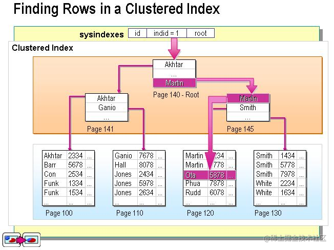
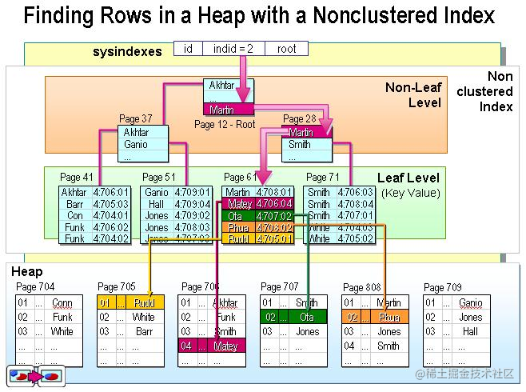

下述内容出自：

- [https://www.cnblogs.com/xiaomandujia/p/17910951.html](https://www.cnblogs.com/xiaomandujia/p/17910951.html)
- [https://www.cnblogs.com/SunSpring/p/16308812.html](https://www.cnblogs.com/SunSpring/p/16308812.html)

## SqlServer中的索引?

可以把索引理解为一种特殊的目录。微软的SQL SERVER提供了两种索引：聚集索引（clustered index，也称聚类索引、簇集索引）和非聚集索引（nonclustered index，也称非聚类索引、非簇集索引）。

- 聚集索引图

​	叶子节点就是真实的数据节点

- 非集聚索引图

  

  叶子节点也是数据节点，该节点存储的是真实数据的内存地址。

## 请简述Sql Server中的分布式查询的功能和用法？

分布式查询是 Microsoft® SQL Server 支持的一项功能，它可以将来自多个数据库服务器的数据整合在一起，以便用户在一个统一的视图中查看所有数据。
分布式查询的用法主要有两种：

1. 使用 T-SQL 语句实现分布式查询；
2. 使用 SQL Server Management Studio 或 Visual Studio 进行可视化设计，以实现分布式查询。
   这两种方法都可以有效地实现 SQL Server 中的分布式查询，并且可以根据实际需求选择最适合的方法。
   更多信息可参考“Sql Server 分布式查询的概念和用法”，“Microsoft® SQL Server分布式查询功能及其用法”，“分布式查询: SQL Server 支持的功能及用法”。

## 请列举一些常用的Sql Server高可用性解决方案。

常见的 SQL Server 高可用性解决方案包括以下几种：

- AlwaysOn Availability Groups（AlwaysOn可用性组）
- Database Mirroring（数据库镜像）
- Log Shipping（日志传输）
- Failover Clustering（故障转移集群）
- Replication（复制）

每种解决方案都有其特点和适用场景，因此在选择时应根据实际情况确定最合适的方案。
更多信息可参考“SQL Server中的高可用性解决方案”，“了解 SQL Server 的高可用性和灾难恢复解决方案”，“【教程】深入浅出了解 Sql Server 高可用解决方案”。

## 如何在Sql Server中实现存储过程的调优？

为了实现 SQL Server 存储过程的调优，可以采取以下几个步骤：

1. 了解存储过程的运行时间和资源消耗情况，可以通过 SQL Profiler 工具或其他监控工具来获取这些信息。
2. 优化存储过程的逻辑结构，使其更加高效。
3. 使用正确的数据类型，以及合理的索引策略。
4. 尽可能地减少临时表的使用，以及在存储过程中避免使用游标。
5. 利用 SET STATISTICS IO 和 SET STATISTICS TIME 等命令收集存储过程的相关统计信息，以确定是否存在性能瓶颈。

更多信息可参考“SQL Server存储过程调优技巧”，“SQL Server 存储过程的优化方法”，“SQL Server存储过程调优的一些常见方法”。

## 请简述Sql Server中的索引优化技巧

SQL Server 中的索引优化技巧主要包括以下几个方面：

1. 根据实际需要选择合适的索引类型，如聚集索引、非聚集索引等。
2. 在合适的情况下使用组合索引。
3. 合理安排索引顺序，尽量把选择性较高的列放在前面。
4. 注意索引大小的影响。
5. 及时更新和删除不必要的索引。

通过对上述技巧的应用，可以帮助提升 SQL Server 查询性能，改善用户体验。
更多信息可参考“SQL Server索引优化技巧”，“【攻略】优化 SQL Server 索引的六大原则”，“SQL Server中优化索引的一些实用方法”。

## 如何在Sql Server中实现内存优化？

为了在 SQL Server 中实现内存优化，可以采取以下几个措施：

1. 限制数据库的最大内存使用量。
2. 指定特定工作负荷使用的最小和最大内存量。
3. 使用自动内存管理模式。
4. 为缓冲池分配适当的内存空间。
5. 监控系统资源利用率，并及时调整内存配置。

以上措施可以帮助优化 SQL Server 内存使用情况，并有效提升系统性能和稳定性。
更多信息可参考“如何在 SQL Server 中实现内存优化？”，“Sql Server内存优化详细步骤”，“SQL Server内存优化的一些实战经验分享”。

## 如何在Sql Server中实现索引的重建？

SQL Server 中索引的重建可以通过 Transact-SQL 语句实现，具体操作如下：

1. 执行 REBUILD INDEX 语句来重建索引。
2. 使用 DBCC DBREINDEX 语句重建索引。
3. 在 SQL Server Management Studio 中重建索引。

在重建索引时需要注意索引大小、重建时间等因素，并合理安排索引重建的时间，以免影响系统的正常运行。
更多信息可参考“SQL Server 索引重建步骤”，“如何在 SQL Server 中实现索引重建？”，“SQL Server索引重建的详细方法”。