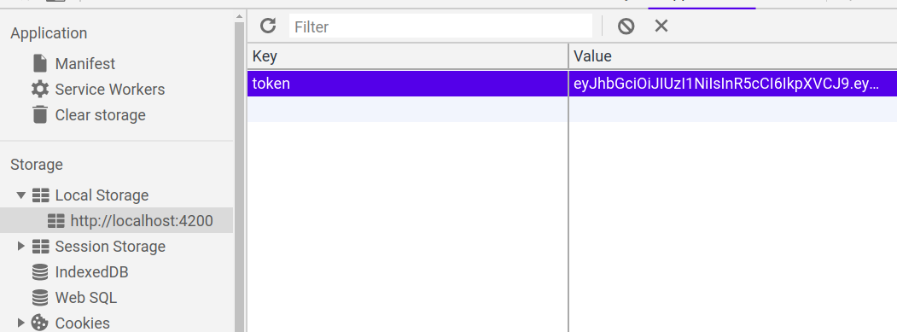
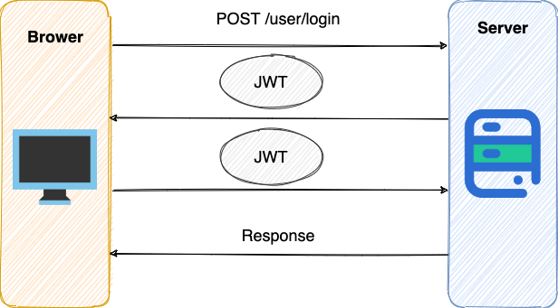

## 认证 (Authentication) 和授权 (Authorization)的区别是什么？

说简单点就是：

- **认证 (Authentication)：** 你是谁。
- **授权 (Authorization)：** 你有权限干什么。

稍微正式点（啰嗦点）的说法就是 ：

- **Authentication（认证）** 是验证您的身份的凭据（例如用户名/用户 ID 和密码），通过这个凭据，系统得以知道你就是你，也就是说系统存在你这个用户。所以，Authentication 被称为身份/用户验证。
- **Authorization（授权）** 发生在 **Authentication（认证）**之后。授权嘛，光看意思大家应该就明白，它主要掌管我们访问系统的权限。比如有些特定资源只能具有特定权限的人才能访问比如 admin，有些对系统资源操作比如删除、添加、更新只能特定人才具有。

## Cookie 和 Session 有什么区别？

Session 的主要作用就是通过服务端记录用户的状态。 典型的场景是购物车，当你要添加商品到购物车的时候，系统不知道是哪个用户操作的，因为 HTTP 协议是无状态的。服务端给特定的用户创建特定的 Session 之后就可以标识这个用户并且跟踪这个用户了。

Cookie 数据保存在客户端(浏览器端)，Session 数据保存在服务器端。相对来说 Session 安全性更高。为了保证 Cookie中信息的安全性，最好能将 Cookie 信息加密然后使用到的时候再去服务器端解密。

## 如果没有 Cookie 的话 Session 还能用吗？

一般是通过 `Cookie` 来保存 `SessionID` ，假如你使用了 `Cookie` 保存 `SessionID` 的方案的话， 如果客户端禁用了 `Cookie`，那么 `Session` 就无法正常工作。

但是，并不是没有 `Cookie` 之后就不能用 `Session` 了，比如你可以将 `SessionID` 放在请求的 `url` 里面`https://javaguide.cn/?Session_id=xxx` 。这种方案的话可行，但是安全性和用户体验感降低。当然，为了你也可以对 `SessionID` 进行一次加密之后再传入后端。

## 为什么 Cookie 无法防止 CSRF 攻击，而 Token 可以？

**CSRF**（Cross Site Request Forgery）一般被翻译为 **跨站请求伪造** 。那么什么是 **跨站请求伪造** 呢？说简单用你的身份去发送一些对你不友好的请求。举个简单的例子：

小壮登录了某网上银行，他来到了网上银行的帖子区，看到一个帖子下面有一个链接写着“科学理财，年盈利率过万”，小壮好奇的点开了这个链接，结果发现自己的账户少了 10000 元。这是这么回事呢？原来黑客在链接中藏了一个请求，这个请求直接利用小壮的身份给银行发送了一个转账请求,也就是通过你的 Cookie 向银行发出请求。

```html
<a src=http://www.mybank.com/Transfer?bankId=11&money=10000>科学理财，年盈利率过万</>
```

上面也提到过，进行 `Session` 认证的时候，我们一般使用 `Cookie` 来存储 `SessionId`,当我们登陆后后端生成一个 `SessionId` 放在 Cookie 中返回给客户端，服务端通过 Redis 或者其他存储工具记录保存着这个 `SessionId`，客户端登录以后每次请求都会带上这个 `SessionId`，服务端通过这个 `SessionId` 来标示你这个人。如果别人通过 `Cookie` 拿到了 `SessionId` 后就可以代替你的身份访问系统了。

`Session` 认证中 `Cookie` 中的 `SessionId` 是由浏览器发送到服务端的，借助这个特性，攻击者就可以通过让用户误点攻击链接，达到攻击效果。

但是，我们使用 `Token` 的话就不会存在这个问题，在我们登录成功获得 `Token` 之后，一般会选择存放在 `localStorage`（浏览器本地存储）中。然后我们在前端通过某些方式会给每个发到后端的请求加上这个 `Token`,这样就不会出现 CSRF 漏洞的问题。因为，即使有个你点击了非法链接发送了请求到服务端，这个非法请求是不会携带 `Token` 的，所以这个请求将是非法的。



需要注意的是不论是 `Cookie` 还是 `Token` 都无法避免 **跨站脚本攻击（Cross Site Scripting）XSS** 。

> 跨站脚本攻击（Cross Site Scripting）缩写为 CSS 但这会与层叠样式表（Cascading Style Sheets，CSS）的缩写混淆。因此，有人将跨站脚本攻击缩写为 XSS。

XSS 中攻击者会用各种方式将恶意代码注入到其他用户的页面中。就可以通过脚本盗用信息比如 `Cookie` 。

具体推荐阅读：[前端安全系列（二）：如何防止CSRF攻击？](https://tech.meituan.com/2018/10/11/fe-security-csrf.html)

## 什么是 Token?什么是 JWT?

我们知道 `Session` 信息需要保存一份在服务器端。这种方式会带来一些麻烦，比如需要我们保证保存 `Session` 信息服务器的可用性、不适合移动端（依赖 `Cookie`）等等。

有没有一种不需要自己存放 `Session` 信息就能实现身份验证的方式呢？使用 `Token` 即可！**JWT** （JSON Web Token） 就是这种方式的实现，通过这种方式服务器端就不需要保存 `Session` 数据了，只用在客户端保存服务端返回给客户的 `Token` 就可以了，扩展性得到提升。

**JWT 本质上就一段签名的 JSON 格式的数据。由于它是带有签名的，因此接收者便可以验证它的真实性。**

JWT 由 3 部分构成:

1. **Header** : 描述 JWT 的元数据，定义了生成签名的算法以及 `Token` 的类型。
2. **Payload** : 用来存放实际需要传递的数据
3. **Signature（签名）** ：服务器通过`Payload`、`Header`和一个密钥(`secret`)使用 `Header` 里面指定的签名算法（默认是 HMAC SHA256）生成。

## 如何基于 Token 进行身份验证？

在基于 Token 进行身份验证的的应用程序中，服务器通过`Payload`、`Header`和一个密钥(`secret`)创建令牌（`Token`）并将 `Token` 发送给客户端，客户端将 `Token` 保存在 Cookie 或者 localStorage 里面，以后客户端发出的所有请求都会携带这个令牌。你可以把它放在 Cookie 里面自动发送，但是这样不能跨域，所以更好的做法是放在 HTTP Header 的 Authorization 字段中：`Authorization: Bearer Token`。



1. 用户向服务器发送用户名和密码用于登陆系统。
2. 身份验证服务响应并返回了签名的 JWT，上面包含了用户是谁的内容。
3. 用户以后每次向后端发请求都在 `Header` 中带上 JWT。
4. 服务端检查 JWT 并从中获取用户相关信息。