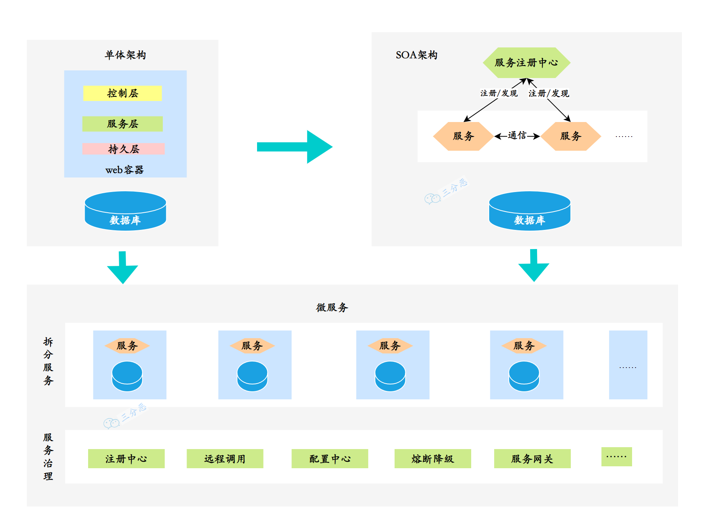
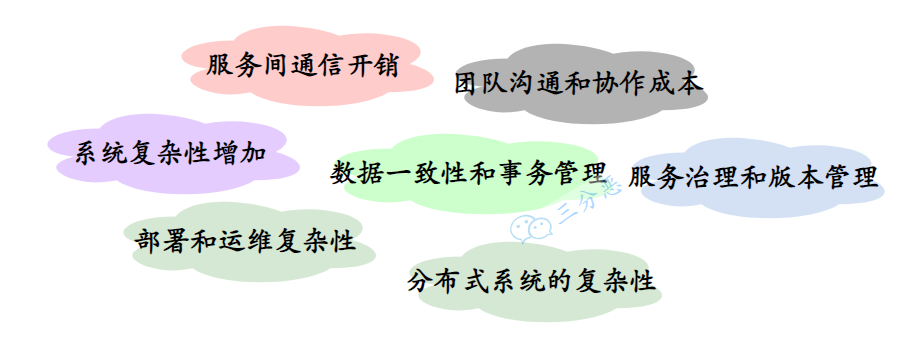
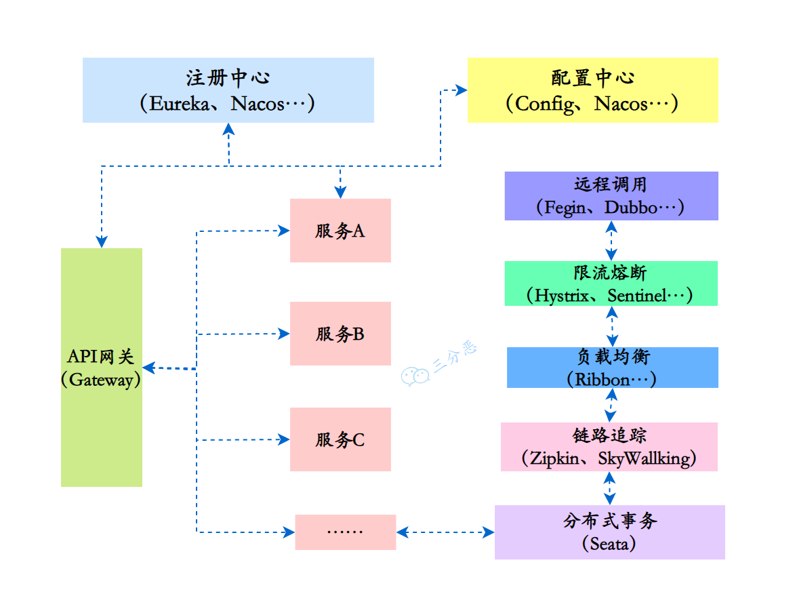

部份内容引述：

- [https://www.cnblogs.com/three-fighter/p/17704215.html](https://www.cnblogs.com/three-fighter/p/17704215.html)
- [http://easy-dotnet.com/pages/11e99f/](http://easy-dotnet.com/pages/11e99f/)

## 什么是微服务架构？

对微服务进行管理整合应用的。微服务架构 依赖于 微服务，是在微服务基础之上的。

例如：上面已经列举了什么是微服务。在医院里，每一个科室都是一个独立的微服务，那么 这个医院 就是 一个大型的微服务架构，就类似 院长 可以 对下面的 科室进行管理。微服务架构主要就是这种功能。

## 什么是微服务？

微服务（Microservices）是一种软件架构风格，将一个大型应用程序划分为一组小型、自治且松耦合的服务。每个微服务负责执行特定的业务功能，并通过轻量级通信机制（如HTTP）相互协作。每个微服务可以独立开发、部署和扩展，使得应用程序更加灵活、可伸缩和可维护。

在微服务的架构演进中，一般可能会存在这样的演进方向：单体式-->服务化-->微服务。

单体服务一般是所有项目最开始的样子：

- 单体服务（Monolithic Service）是一种传统的软件架构方式，将整个应用程序作为一个单一的、紧耦合的单元进行开发和部署。单体服务通常由多个模块组成，这些模块共享同一个数据库和代码库。然而，随着应用程序规模的增长，单体服务可能变得庞大且难以维护，且部署和扩展困难。

后来，单体服务过大，维护困难，渐渐演变到了分布式的SOA：

- SOA（Service-Oriented Architecture，面向服务的架构）是一种软件架构设计原则，强调将应用程序拆分为相互独立的服务，通过标准化的接口进行通信。SOA关注于服务的重用性和组合性，但并没有具体规定服务的大小。
- 微服务是在SOA的基础上进一步发展而来，是一种特定规模下的服务拆分和部署方式。微服务架构强调将应用程序拆分为小型、自治且松耦合的服务，每个服务都专注于特定的业务功能。这种架构使得应用程序更加灵活、可伸缩和可维护。

需要注意的是，微服务是一种特定的架构风格，而SOA是一种设计原则。微服务可以看作是对SOA思想的一种具体实践方式，但并不等同于SOA。

微服务与单体服务的区别在于规模和部署方式。微服务将应用程序拆分为更小的、自治的服务单元，每个服务都有自己的数据库和代码库，可以独立开发、测试、部署和扩展，带来了更大的灵活性、可维护性、可扩展性和容错性。

## 微服务带来了哪些挑战？

微服务架构不是万金油，尽它有很多优点，但是对于是否采用微服务架构，是否将原来的单体服务进行拆分，还是要考虑到服务拆分后可能带来的一些挑战和问题：

1. 系统复杂性增加：一个服务拆成了多个服务，整体系统的复杂性增加，需要处理服务之间的通信、部署、监控和维护等方面的复杂性。
2. 服务间通信开销：微服务之间通过网络进行通信，传递数据需要额外的网络开销和序列化开销，可能导致性能瓶颈和增加系统延迟。
3. 数据一致性和事务管理：每个微服务都有自己的数据存储，数据一致性和跨服务的事务管理变得更加复杂，需要额外解决分布式事务和数据同步的问题。
4. 部署和运维复杂性：微服务架构涉及多个独立部署的服务，对于部署、监控和容错机制的要求更高，需要建立适当的部署管道和自动化工具，以简化部署和运维过程。
5. 团队沟通和协作成本：每个微服务都由专门的团队负责，可能增加团队之间的沟通和协作成本。需要有效的沟通渠道和协作机制，确保服务之间的协调和一致性。
6. 服务治理和版本管理：随着微服务数量的增加，服务的治理和版本管理变得更加复杂。需要考虑服务的注册发现、负载均衡、监控和故障处理等方面，以确保整个系统的可靠性和稳定性。
7. 分布式系统的复杂性：微服务架构涉及构建和管理分布式系统，而分布式系统本身具有一些固有的挑战，如网络延迟、分布式一致性和容错性。

简单说，采用微服务需要权衡这些问题和挑战，根据实际的需求来选择对应的技术方案，很多时候单体能搞定的也可以用单体，不能为了微服务而微服务。

## 说下微服务有哪些组件？

微服务给系统开发带来了一些问题和挑战，如服务调用的复杂性、分布式事务的处理、服务的动态管理等。为了更好地解决这些问题和挑战，各种微服务治理的组件应运而生，充当微服务架构的基石和支撑。

## 微服务之间如何独立通讯的?

- 同步通信：.Net5通过 RPC GRPC 远程过程调用或者通过 REST 接口json调用 等。
- 异步通信：消息队列，如：RabbitMq、ActiveM、Kafka 等。

## 什么是熔断？什么是服务降级？

服务熔断的作用类似于我们家用的保险丝，当某服务出现不可用或响应超时的情况时，为了防止整个系统出现雪崩，暂时停止对该服务的调用。

服务降级是从整个系统的负荷情况出发和考虑的，对某些负荷会比较高的情况，为了预防某些功能（业务场景）出现负荷过载或者响应慢的情况，在其内部暂时舍弃对一些非核心的接口和数据的请求，而直接返回一个提前准备好的fallback（退路）错误处理信息。这样，虽然提供的是一个有损的服务，但却保证了整个系统的稳定性和可用性。

## 微服务的优缺点是什么？说下你在项目中碰到的坑。

- 优点：松耦合，聚焦单一业务功能，无关开发语言，团队规模降低。在开发中，不需要了解多有业务，只专注于当前功能，便利集中，功能小而精。微服务一个功能受损，对其他功能影响并不是太大，可以快速定位问题。微服务只专注于当前业务逻辑代码，不会和 html、css 或其他界面进行混合。可以灵活搭配技术，独立性比较舒服。
- 缺点：随着服务数量增加，管理复杂，部署复杂，服务器需要增多，服务通信和调用压力增大，运维工程师压力增大，人力资源增多，系统依赖增强，数据一致性，性能监控。

## 你所知道微服务的技术栈有哪些？列举一二。

微服务条目 落地技术 

- 服务开发 AspnetCore、.Net5、.Net6 服务配置与管理 携程公司的Apollo、社区的的Consul等 
- 服务注册与发现 Eurka、Consul、Zookeeper等 
- 服务调用 Rest（服务通信）、RPC、GRpc 
- 服务熔断器 Polly、Envoy等 
- 负载均衡 Nginx等 
- 服务接口调用（客户端简化工具） WebAPI等 
- 消息队列 Kafka、RabbitMQ、ActiveMQ等 
- 服务配置中心管理 Apollo、Chef等 服务路由（API网关） Ocelot等 
- 服务监控 Zabbix，Nagios，Skywalking等 
- 全链路追踪 Zipkin，Brave，Skywalking等 
- 服务部署 Docker，OpenStack，Kubernetes等 
- 数据流操作开发包 SpringCloud Stream（封装与Redis，Rabbit，kafka等发送接收消息） 
- 事件消息总线CAP

## 设计微服务的最佳实践是什么？

1. 为每个微服务分开数据存储
2. 将代码保持在类似的成熟度等级上
3. 为每个微服务进行单独的构建
4. 部署到容器中
5. 将服务器视为无状态的

## 容器在微服务中的用途是什么？

容器是管理基于微服务的程序以便单独开发和部署它们的好方法*。*你可以将微服务封装在容器镜像及其依赖项中，然后可以用它来滚动开发按需实例的微服务而无需任何额外的工作。