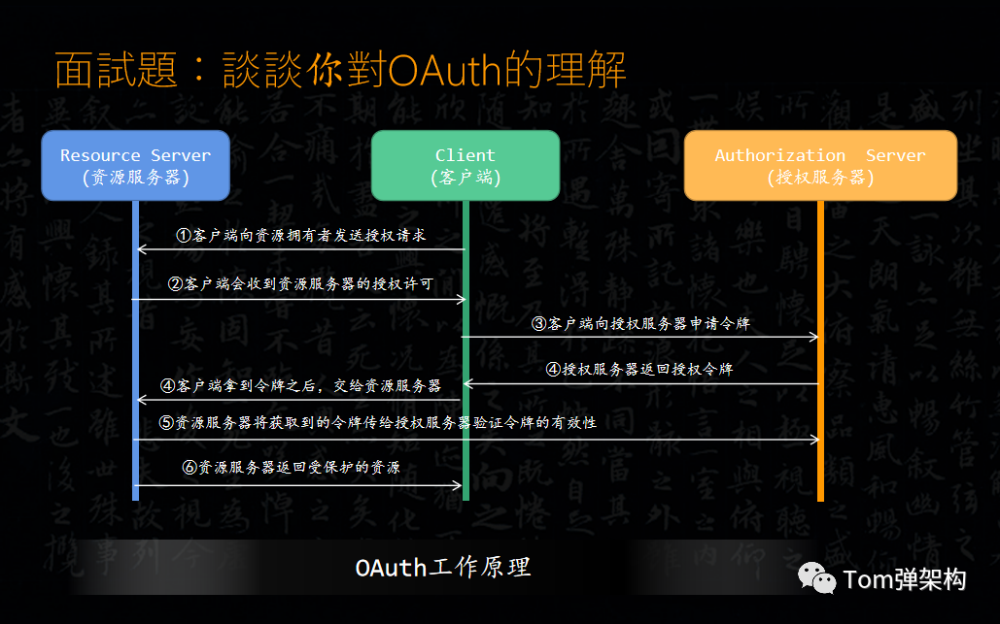

下述内容出自：

- [13个认证授权常见面试题/知识点总结！（2021 最新版）](https://blog.csdn.net/AttleeTao/article/details/117930495)
- [Java高频面试题，谈谈你对OAuth的理解，这道题你会了吗？](https://cloud.tencent.com/developer/article/2195604)
- [https://www.cnblogs.com/chenshibao/p/18592017](https://www.cnblogs.com/chenshibao/p/18592017)

## 什么是 SSO?

SSO(Single Sign On)即单点登录说的是用户登陆多个子系统的其中一个就有权访问与其相关的其他系统。举个例子我们在登陆了京东金融之后，我们同时也成功登陆京东的京东超市、京东国际、京东生鲜等子系统。

## 什么是 OAuth 2.0？

OAuth 是一个行业的标准授权协议，主要用来授权第三方应用获取有限的权限。而 OAuth 2.0 是对 OAuth 1.0 的完全重新设计，OAuth 2.0 更快，更容易实现，OAuth 1.0 已经被废弃。详情请见：rfc6749[8]。

实际上它就是一种授权机制，它的最终目的是为第三方应用颁发一个有时效性的令牌 Token，使得第三方应用能够通过该令牌获取相关的资源。

OAuth 2.0 比较常用的场景就是第三方登录，当你的网站接入了第三方登录的时候一般就是使用的 OAuth 2.0 协议。

另外，现在 OAuth 2.0 也常见于支付场景（微信支付、支付宝支付）和开发平台（微信开放平台、阿里开放平台等等）。

## 简述一下 OAuth 工作原理?

首先，第1步，客户端向资源拥有者发送授权请求，一般资源拥有者的资源会存放在资源服务器。

第2步，客户端会收到资源服务器的授权许可，

第3步：客户端拿到许可之后，再向授权服务器发送一次验证，给客户端颁发一个Access Token访问令牌。

第4步：客户端拿到令牌之后，交给资源服务器。

第5步：资源服务器会将获取到的令牌传给认证服务器验证令牌的有效性。

第6步：资源服务器验证令牌通过之后，就会返回一个受保护的资源。

在我们看到的这个流程中，最重要的是第2步，也就是在第3步获取授权之前，客户端要先申请许可资源的内容，比如用户头像，用户昵称等等。也就是客户端向资源服务器申请授权的时候，需要填写以下授权所需的信息，分别是：应用名称、应用网站、重定向URI或者回调的URL（redirect_uri）、客户端标识client_id和客户端密钥client_secret。这些信息需要我们在 。

## 简述一下 什么是 OAuth 2.0 四个角色

**四个角色:**

- resource owner：资源所有者，这里可以理解为用户。
- client：客户端，可以理解为一个第三方的应用程序 即微博 CSDN。
- resource server：资源服务器，它存储用户或其它资源。
- authorization server：认证/授权服务器，它认证resource owner的身份，为 resource owner提供授权审批流程，并最终颁发授权令牌(Access Token)。

认证服务器只有一个 sysauth，资源服务器 订单 商品 支付

认证的流程

## 简介一下OAuth2.0的四种模式？

1. 授权码模式（Authorization Code）

   **适用场景**：最安全的模式，适合有后端的 Web 应用。
   **流程**：

   1. 用户被重定向到认证服务器（如 Google 登录页面）。
   2. 用户授权后，认证服务器返回**授权码（Authorization Code）**到后端。
   3. 后端用授权码换取 **Access Token**（避免令牌暴露给前端）。

**特点**：

- 支持 `refresh_token` 刷新令牌。
- 需客户端保密（如服务器端应用）。

2. 简单模式（Implicit）

   **适用场景**：纯前端应用（如 SPA），无后端参与。
   **流程**：

   1. 用户授权后，认证服务器直接在前端 URL 片段（Hash）中返回 **Access Token**。
   2. 前端通过 JavaScript 提取令牌。

**特点**：

- 令牌暴露给前端，仅适合短期令牌。
- 无 `refresh_token`，安全性较低（已逐渐被 PKCE 替代）。

3. 密码模式（Resource Owner Password Credentials）

   **适用场景**：高度信任的客户端（如自家公司的移动应用）。
   **流程**：

   1. 用户直接向客户端提供**用户名和密码**。
   2. 客户端用这些凭证直接换取 **Access Token**。

   

   **特点**：

   - 需完全信任客户端（因用户密码暴露）。
   - 适用于传统应用迁移到 OAuth 的过渡方案。

4. 客户端模式

   **适用场景**：机器对机器（M2M）通信，无用户参与。
   **流程**：

   1. 客户端用自己的 `client_id` 和 `client_secret` 直接换取 **Access Token**。

   

   **特点**：

   - 仅用于服务端 API 调用（如定时任务、微服务间通信）。
   - 不涉及用户授权。

## 什么是IdentityServer4?

它是一个中间件服务框架，集成OIDC与OAuth2.0,方便搭建任意多个项目。

## OpenID、OIDC 和 OAuth 的区别

1. OpenID 是认证，OAuth2.0是授权

- Authentication、Authorization
- 一个是登录，一个是授权
- 认证 = 【是不是】，授权 =【给不给】

1. OpenID更简单，只提供一个认证，和字符串去中心化的登录认证，只需要识别URL和OpenID即可，方便——【数字身份识别框架】。
2. OAuth是OpenID的一个补充，但是完全不同的服务，完全不需要提供任何信息给第三方，包括用户名
3. OpenID Connect 兼容 OAuth2.0 + OpenID

- OpenID Connect和OAuth2非常相似 —— 实际上前者是后者的顶级扩展。它们把两个基础安全问题（身份认证和 API 访问）合并成了一个单一的协议。